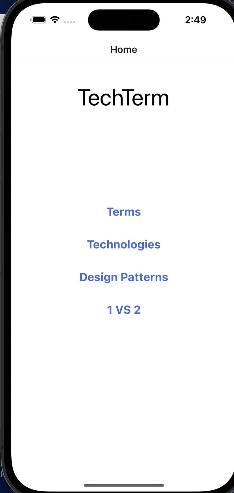
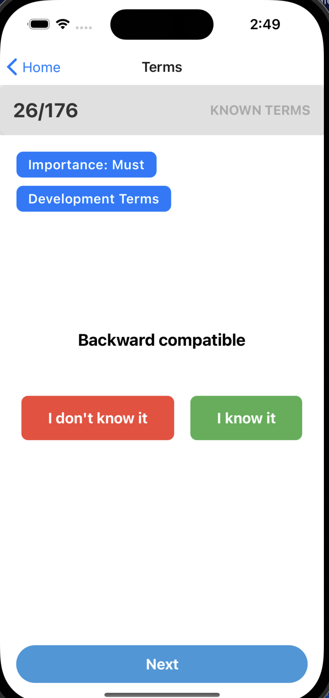

# TechTerm

This is a mobile application that supposed to help you know the tech world in a better way!

## Disclaimer

I am not a mobile developer (@nirsht), not a strong frontend developer and of course not a designer. If you have any improvement suggestion to the UI regarding the code or regarding the design, please read the CONTRIBUTION.md file!

## Motivation

In February 2002, Donald Rumsfeld, the then US Secretary of State for Defense, stated at a Defense Department briefing:
> There are known knowns. There are things we know that we know. There are known unknowns. That is to say, there are things that we now know we don't know. But there are also unknown unknowns. There are things we do not know we don't know.

In the tech world we want to know everything, but because this is such a big industry & subject, we aren't exposed to enough information in our day to day. And there are many things that are unknown unknown, and the goal of this application is to give you the information about the unknown unknown.

## Screenshots

